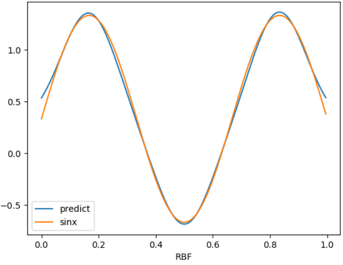

# Computational Intelligence Course 
This repository contains computational intelligence course assignment

## RBF
Radial Basis Function is one of the implementation of neural network. It will be useful where our problem space is curvy or in a circular form. In this assigment I tried to guess Sinus function value based on RBF approach. Below shape how well RBF method can conform Sinus function.

## Genetic Algorithm
Defining polynominal equation and then try to guess the root of this equation with genetic algorithm. To solve this equation I set some fitness function to evaluate the result generated. I defined cross over and mutation function to randomly generate new population. For training phase I initialzed chromose to be about 600 and let them explore the possible values to find the best fitness function.

## CIFAR Classification
Implemented Simple MLP approach for classifying CIFAR dataset with activating momentum and weight decay.

## Fuzzy Inference
used *simpful* library to predict result between two Football teams. defining term and adding some rules were the main part of this assigment.

## MLP Keras
Implemented Neural Network to be fit on Sinus function